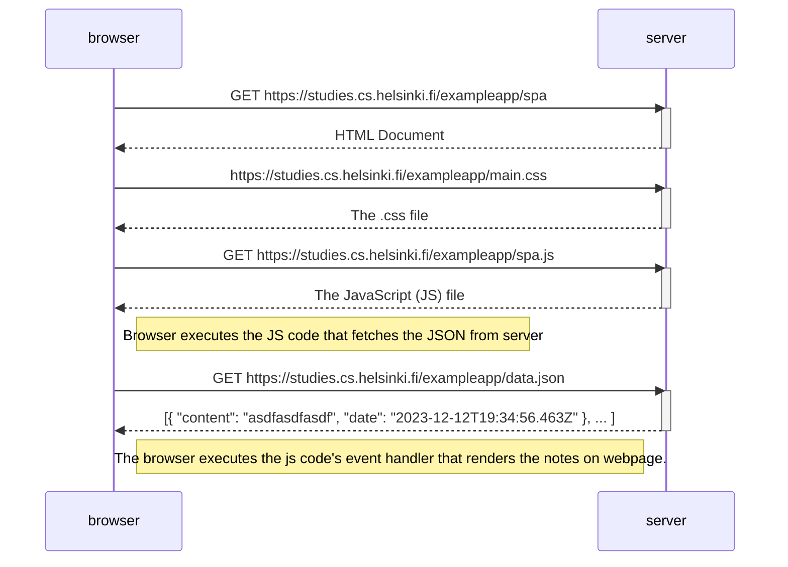

```mermaid
sequenceDiagram
    participant browser
    participant server

    browser->>server: GET https://studies.cs.helsinki.fi/exampleapp/spa
    activate server
    server-->>browser: HTML Document
    deactivate server

    browser->>server: https://studies.cs.helsinki.fi/exampleapp/main.css
    activate server
    server-->>browser: The .css file
    deactivate server

    browser->>server: GET https://studies.cs.helsinki.fi/exampleapp/spa.js
    activate server
    server-->>browser: The JavaScript (JS) file
    deactivate server

    Note right of browser: Browser executes the JS code that fetches the JSON from server

    browser->>server: GET https://studies.cs.helsinki.fi/exampleapp/data.json
    activate server
    server-->>browser: [{ "content": "asdfasdfasdf", "date": "2023-12-12T19:34:56.463Z" }, ... ]
    deactivate server

    Note right of browser: The browser executes the js code's event handler that renders the notes on webpage.
```