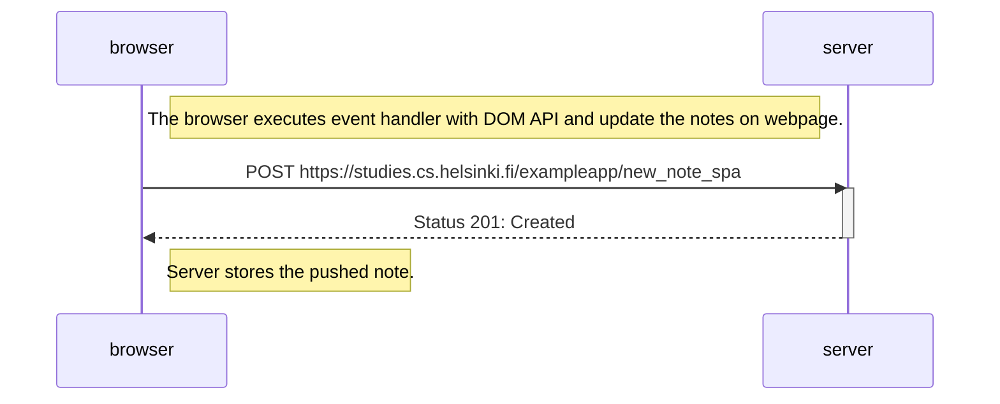

```mermaid
sequenceDiagram
    participant browser
    participant server

    Note right of browser: The browser executes event handler with DOM API and update the notes on webpage.

    browser->>server: POST https://studies.cs.helsinki.fi/exampleapp/new_note_spa
    activate server
    server-->>browser: Status 201: Created
    deactivate server

    Note right of browser: Server stores the pushed note.
```